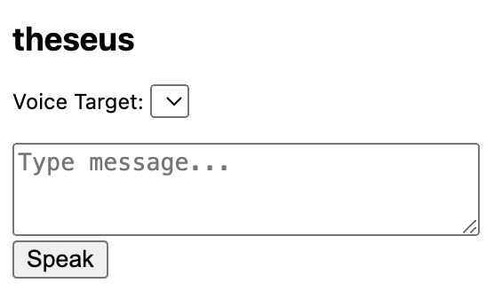

#  Theseus: AI Voice Cloning in Discord Voice Chat

**Theseus** is a local tool that lets you clone a user’s voice (with their consent) and speak as them using typed messages during a Discord voice call. It uses the [ElevenLabs TTS API](https://www.elevenlabs.io/) for realistic voice synthesis and routes the audio through a virtual microphone.

---

## Features

-  Detects active users in a Discord voice channel (via browser extension)
-  Sends typed messages to ElevenLabs for TTS in a selected voice
-  Plays audio through a virtual mic, so Discord thinks it’s a real speaker

---

##  Tech Stack

| Component       | Technology |
|----------------|------------|
| Frontend       | Chrome Extension (Manifest V3 + JS) |
| Backend        | Python (Flask, `pydub`, `requests`) |
| Audio Routing  | VB-Cable (Windows), BlackHole (macOS)|
| Voice Cloning  | ElevenLabs API |

---



##  Architecture

```text
Discord Web (in browser)
 ↳ Extension reads VC users + sends typed text
 ↳ Sends POST to local backend
Python Flask Server
 ↳ Converts text to speech via ElevenLabs
 ↳ Outputs audio to system virtual microphone
Discord hears the speech as if it were from a real mic
